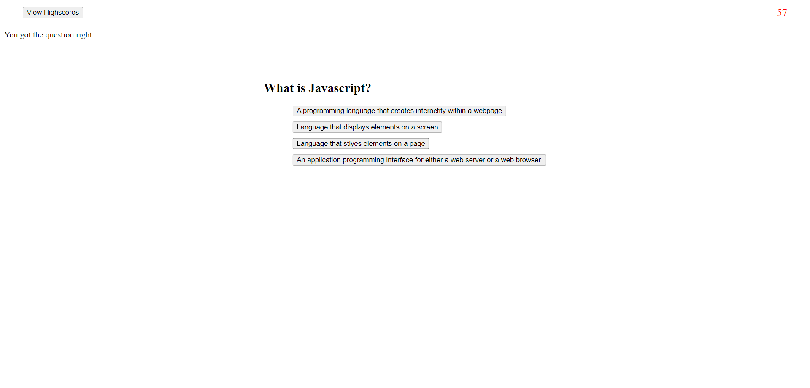

# Project Information
In this challenge I created a Coding Assessment. When the start button is clicked,a timer starts,
the assessment questions pop up on screen, and iterate when an option is picked. Game ends once 
all questions are answered, or timer hits zero. User can enter initals and display their score 
on the high score list.

## Project Requirements
GIVEN I am taking a code quiz
WHEN I click the start button
THEN a timer starts and I am presented with a question
WHEN I answer a question
THEN I am presented with another question
WHEN I answer a question incorrectly
THEN time is subtracted from the clock
WHEN all questions are answered or the timer reaches 0
THEN the game is over
WHEN the game is over
THEN I can save my initials and my score

### Live website and repo

https://github.com/TamirP123/coding-assessment

https://tamirp123.github.io/coding-assessment/

#### Photo of application
